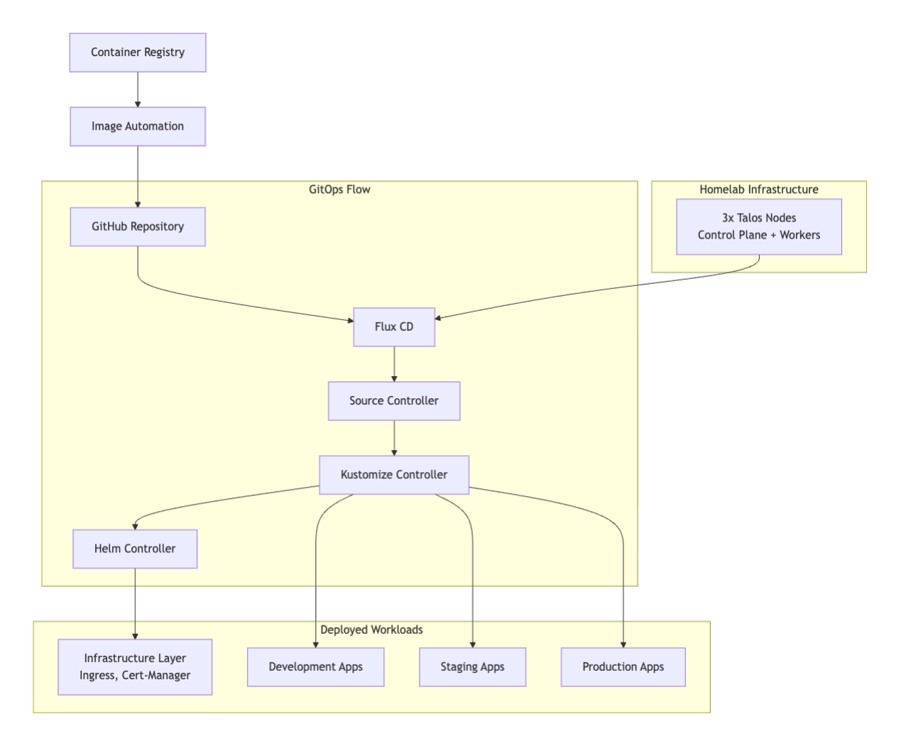
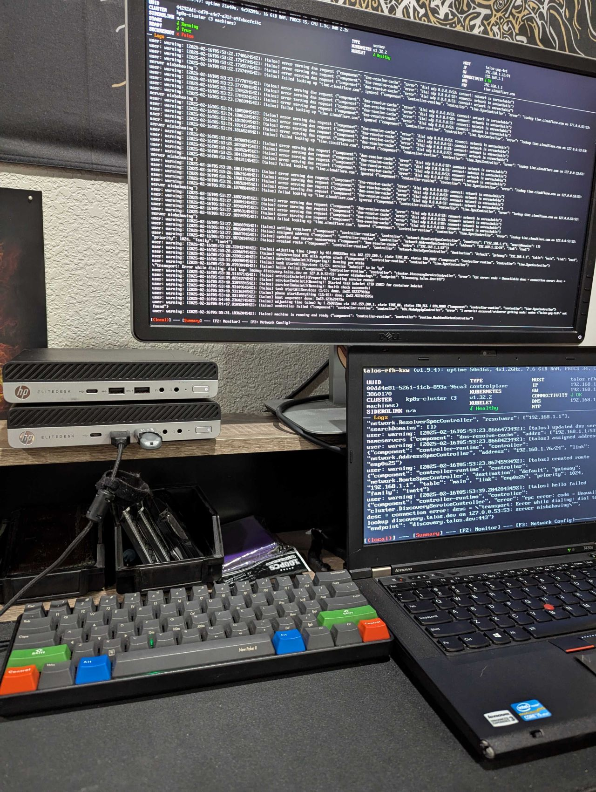

# 🏠 Talos Homelab with Flux CD GitOps

[](https://fluxcd.io)
[](https://kubernetes.io)
[](https://talos.dev)
[](https://www.gitops.tech)
[](https://reddit.com/r/homelab)

## 🎯 Project Overview

This repository showcases my **production-grade homelab** running on bare-metal Talos Linux with complete GitOps automation through Flux CD. Every component in my cluster - from ingress controllers to applications - is defined as code and automatically deployed through Git commits.

### 🏗️ What I Built

A fully automated, self-healing Kubernetes homelab that:
- Runs on **Talos Linux** (immutable, secure-by-default OS)
- Uses **Flux CD** for continuous deployment and drift detection
- Implements **multi-environment** deployments (dev → staging → production)
- Features **automatic TLS certificates** via Let's Encrypt
- Includes **automated image updates** from container registries
- Sends **deployment notifications** to Slack
- Maintains **zero manual kubectl applies** - everything through Git!

## 🚀 Key Features & Achievements

### GitOps Implementation
- ✅ **100% Infrastructure as Code** - No manual deployments
- ✅ **Automatic reconciliation** - Flux syncs every 1-5 minutes
- ✅ **Drift detection & correction** - Cluster self-heals to match Git state
- ✅ **Git-based rollbacks** - Simple `git revert` to undo changes

### Environment Management
- ✅ **Three isolated environments** with namespace separation
- ✅ **Progressive delivery pipeline** - Changes flow through dev → staging → prod
- ✅ **Environment-specific configurations** using Kustomize overlays
- ✅ **Visual environment indicators** - Different UI colors per environment

### Security & Automation
- ✅ **Automated TLS certificates** with cert-manager and Let's Encrypt
- ✅ **Sealed Secrets** for secure secret management
- ✅ **RBAC enforcement** with namespace isolation
- ✅ **Automated container updates** with image scanning

## 🏛️ Architecture



## 💻 Technical Stack

### Platform Layer
- **OS**: Talos Linux v1.6 (Immutable, API-driven, secure-by-default)
- **Kubernetes**: v1.28+ (Deployed via Talos)
- **CNI**: Cilium (eBPF-based networking)
- **Storage**: Local-path provisioner + NFS

### GitOps & Automation
- **Flux CD v2**: GitOps operator
- **Kustomize**: Configuration management
- **Helm**: Package management for infrastructure
- **GitHub Actions**: CI/CD pipelines

### Infrastructure Components
| Component | Purpose | Implementation |
|-----------|---------|----------------|
| **NGINX Ingress** | Edge routing | LoadBalancer with MetalLB |
| **Cert-Manager** | TLS automation | Let's Encrypt ACME |
| **Metrics Server** | Resource metrics | For HPA scaling |


## 📁 Repository Structure

```
flux-cluster/
├── clusters/
│   └── production/
│       ├── flux-system/         # Flux controllers & CRDs
│       ├── infrastructure.yaml  # Infrastructure stack definition
│       └── apps.yaml            # Application deployments
│
├── infrastructure/
│   ├── controllers/             # Cluster-wide services
│   │   ├── ingress-nginx.yaml  # Ingress controller
│   │   ├── cert-manager.yaml   # Certificate management
│   │   └── metrics-server.yaml # Metrics collection
│   │
│   └── configs/                 # Infrastructure configuration
│       └── cluster-issuer.yaml  # Let's Encrypt setup
│
└── apps/
    ├── base/                    # Base application manifests
    │   └── frontend/
    │       ├── deployment.yaml
    │       ├── service.yaml
    │       └── ingress.yaml
    │
    └── overlays/                # Environment-specific patches
        ├── dev/                 # Development environment
        ├── staging/             # Staging environment
        └── production/          # Production environment
```

## 🔄 GitOps Workflow in Action

### How My Deployments Work

1. **I push changes to GitHub** - Update manifests or configurations
2. **Flux detects changes** - Polls repository every minute
3. **Automatic validation** - Flux validates manifests
4. **Progressive rollout** - Changes applied to dev first
5. **Health checks** - Flux waits for pods to be ready
6. **Environment promotion** - Successful changes flow to staging, then production

### Real Example: Deploying an Update

```bash
# I modify the frontend deployment
vim apps/base/frontend/deployment.yaml

# Commit and push
git add . && git commit -m "feat: increase memory limits for frontend"
git push

# Within 1 minute, Flux automatically:
# 1. Detects the change
# 2. Applies to dev environment
# 3. Waits for health checks
# 4. Promotes to staging
# 5. Finally deploys to production

# I can watch the magic happen:
flux get kustomizations --watch
```

## 📊 Homelab Specifications
I am using Talos Linux clustered on three cheap and easy to come by machines:
### Hardware

- Control Plane - Thinkpad T430s - 8Gb RAM, 128 SSD
- Worker Node - HP EliteDesk - 16GB RAM, 256 SSD
- Worker Node - HP EliteDesk - 16GB RAM, 256 SSD

### Current Workloads
- Personal projects and experiments
- Home automation services
- Monitoring and observability stack

## 🎓 Lessons Learned

### Why Talos Linux?
- **Immutable OS** - No SSH, no shell, API-only management
- **Secure by default** - Minimal attack surface
- **Declarative config** - Perfect for GitOps
- **Automatic updates** - OS updates via Kubernetes

### Why Flux CD?
- **True GitOps** - Git as single source of truth
- **Pull-based** - More secure than push-based CI/CD
- **Multi-tenancy** - Perfect for multiple environments
- **Extensible** - Easy to add new controllers
- **CLI Based** - Makes it cooler than Argo CD

### Challenges Overcome
1. **Sealed Secrets rotation** - Automated key rotation strategy
2. **Resource constraints** - Implemented proper resource limits and HPA
3. **Ingress on bare metal** - Solved with MetalLB
4. **Persistent storage** - NFS provisioner for stateful workloads

## 🛠️ Setup Instructions

### Prerequisites
- Talos Linux cluster (3+ nodes recommended)
- kubectl configured for cluster access
- GitHub account and personal access token
- Flux CLI installed locally

### Bootstrap Process

```bash
# 1. Clone this repository
git clone https://github.com/kylepottercf/flux-cluster
cd flux-cluster

# 2. Install Flux on the cluster
export GITHUB_TOKEN=<your-token>
flux bootstrap github \
  --owner=kylepottercf \
  --repository=flux-cluster \
  --branch=main \
  --path=./clusters/production \
  --personal

# 3. Watch the magic happen
flux get all --watch
```

### Verify Deployment

```bash
# Check Flux status
flux check

# View deployed resources
kubectl get all -A

# Check ingress endpoints
kubectl get ingress -A
```

## 🔍 Monitoring & Operations

### Observability Stack

Will be looking to add these additions in the future, along side some persistant storage for the cluster.
- **Prometheus** - Metrics collection
- **Grafana** - Visualization dashboards


### Useful Commands

```bash
# Force reconciliation
flux reconcile kustomization apps-production --with-source

# View Flux logs
flux logs --follow --tail=20

# Check deployment status
flux get helmreleases -A
flux get kustomizations -A

# Debug issues
kubectl events -n flux-system --for kustomization/apps-production
```

## 🚀 Future Enhancements

- [ ] Integrate HashiCorp Vault for secrets
- [ ] Set up Crossplane for cloud resources
- [ ] Add Persistant Storage to my homelab 
- [ ] Setup Prometheus and Grafana for Monitoring

## 📈 Project Impact

This homelab setup has:
- **Eliminated manual deployments** - 100% GitOps
- **Reduced deployment time** - From hours to minutes
- **Improved reliability** - Self-healing infrastructure
- **Enhanced security** - Immutable OS, sealed secrets
- **Provided learning platform** - Enterprise practices at home

## 🏆 Technologies Showcased

- **GitOps** methodology with Flux CD
- **Immutable infrastructure** with Talos Linux
- **Multi-environment** deployment strategies  
- **Infrastructure as Code** principles
- **Kubernetes** best practices
- **Security-first** architecture
- **Automated certificate** management
- **Container image** automation

## 📚 Resources & Documentation

- [My Blog Post: Building a GitOps Homelab](#) *(Coming soon)*
- [Flux CD Documentation](https://fluxcd.io/docs/)
- [Talos Linux Documentation](https://www.talos.dev/docs/)

## 📝 License

MIT License - Feel free to use this as inspiration for your own homelab!